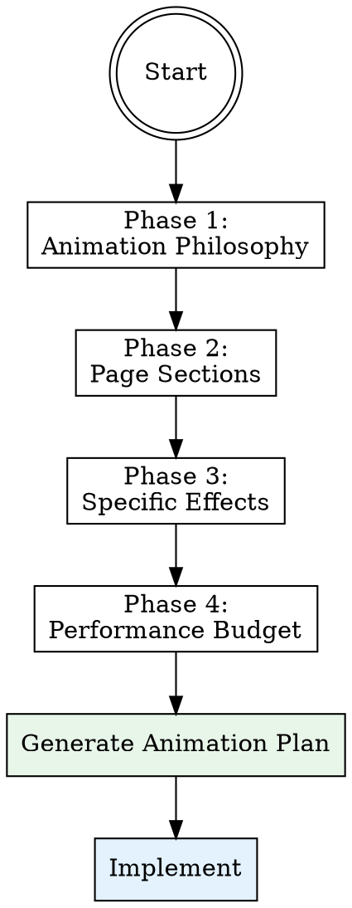
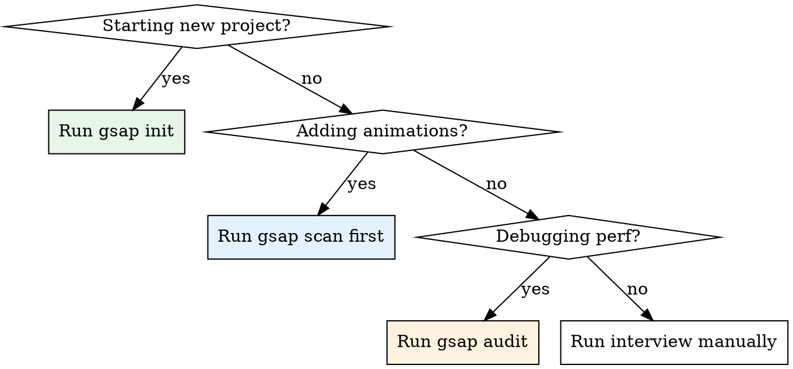

# GSAP Animated Frontend

## Overview

Build production-grade animated websites and landing pages using GSAP (GreenSock Animation Platform). This skill guides Claude through a **structured discovery interview** to understand the user's animation vision, then implements animations using battle-tested GSAP patterns.

**Core principle:** Every animation must serve a purpose — guide attention, communicate hierarchy, build trust, or create delight. Animation without intent is distraction.

## When to Use

- User wants to build an animated landing page or website from scratch
- User wants to add animations to an existing site
- User mentions GSAP, ScrollTrigger, parallax, page transitions, micro-interactions
- User wants a site to feel "alive", "premium", "polished", "like [reference site]"
- User is redesigning UI and wants motion design
- User shares a reference site with animations they want to replicate

## The Discovery Interview

**MANDATORY: Before writing ANY animation code, run this interview.** Present questions one phase at a time. Each question has recommended options with visual previews. Let the user pick or describe their own.



### Phase 1: Animation Philosophy (Ask These First)

**Q1: What's the overall animation personality?**

| Option | Description | Best For | Example Sites |
|--------|-------------|----------|---------------|
| **Subtle & Professional** (Recommended) | Gentle fades, smooth slides, minimal motion. Clean and trustworthy. | Business sites, SaaS, booking platforms, dashboards | Stripe.com, Linear.app, Booking.com |
| **Bold & Cinematic** | Large-scale reveals, dramatic parallax, full-screen transitions. High visual impact. | Portfolios, agencies, product launches, luxury brands | Apple.com product pages, Awwwards winners |
| **Playful & Bouncy** | Spring physics, elastic easing, overshoots, character. Fun and memorable. | Creative agencies, kids/education, gaming, social apps | Slack.com, Duolingo, Discord |
| **Elegant & Editorial** | Smooth text reveals, staggered typography, refined motion. Premium feel. | Fashion, real estate, magazines, luxury | Vogue.com, high-end real estate sites |

**Q2: What's the animation density?**

| Option | Description | Performance | UX Impact |
|--------|-------------|-------------|-----------|
| **Light Touch** (Recommended) | Only hero + key CTAs animated. Rest is static with hover states. | Excellent | Focused attention |
| **Moderate** | Hero + section entrances + cards + hover states. Core content animated. | Good | Rich but controlled |
| **Heavy** | Everything animates — background elements, floating shapes, continuous motion. | Moderate | Immersive but can overwhelm |
| **Cinematic Sections** | Each scroll section is a full "scene" with choreographed reveals. | Variable | Storytelling-driven |

**Q3: What's the scroll behavior preference?**

| Option | Description | GSAP Plugin |
|--------|-------------|-------------|
| **Scroll-triggered reveals** (Recommended) | Elements animate in as they enter viewport. Natural and performant. | ScrollTrigger |
| **Parallax layers** | Background/foreground move at different speeds creating depth. | ScrollTrigger with scrub |
| **Scroll-locked scenes** | Scroll progress controls animation timeline — scrub through scenes. | ScrollTrigger pin + scrub |
| **Horizontal scroll sections** | Convert vertical scroll to horizontal movement for specific sections. | ScrollTrigger + pin |
| **No scroll animations** | Only load animations and hover/click interactions. | Core GSAP only |

### Phase 2: Page Sections (Ask Per Section)

For each major page section, ask:

**"What animation style do you want for [section name]?"**

Present these options per section type:

#### Hero Section Options

| Option | Animation | Code Pattern |
|--------|-----------|-------------|
| **Text Reveal** (Recommended) | Headline slides up with stagger, subtitle fades in, CTA bounces in | `splitText + stagger timeline` |
| **Cinematic Zoom** | Background image scales from 1.2 to 1.0, content fades over it | `gsap.from(bg, {scale: 1.2})` |
| **Particle/Shape Background** | Floating geometric shapes behind content, continuous subtle motion | `gsap.to() with repeat:-1` |
| **Video Hero with Text Overlay** | Video plays, text elements animate in sequence over it | `timeline after video load` |
| **Morphing Gradient** | Animated gradient background that shifts colors smoothly | `CSS custom properties + gsap` |
| **3D Perspective Tilt** | Hero card/content has subtle 3D tilt on mouse move | `mousemove + gsap.quickTo()` |

#### Card Grid / Listing Options

| Option | Animation | Code Pattern |
|--------|-----------|-------------|
| **Staggered Fade-Up** (Recommended) | Cards fade in and slide up one by one as row enters view | `ScrollTrigger + stagger` |
| **Scale Pop** | Cards start at scale 0.8 and pop to 1.0 with slight bounce | `gsap.from({scale:0.8, ease:"back"})` |
| **Flip Reveal** | Cards rotate in from Y-axis like flipping | `gsap.from({rotateY:90})` |
| **Masonry Cascade** | Cards fill in from top-left cascading diagonally | `stagger with grid layout` |
| **Hover Lift Only** | No entrance animation, but rich hover: lift + shadow + image zoom | `mouseenter/mouseleave gsap.to()` |

#### Stats / Numbers Section Options

| Option | Animation | Code Pattern |
|--------|-----------|-------------|
| **Count Up** (Recommended) | Numbers animate from 0 to final value when section enters view | `gsap.to() with snap + onUpdate` |
| **Odometer Roll** | Digits roll like an odometer/slot machine | `digit stagger with y transform` |
| **Draw-in Icons** | SVG icons draw their stroke paths, then numbers fade in | `drawSVG or stroke-dasharray` |
| **Scale + Count** | Numbers scale up from small while counting | `scale + textContent update` |

#### Testimonials / Reviews Options

| Option | Animation | Code Pattern |
|--------|-----------|-------------|
| **Carousel Slide** (Recommended) | Auto-playing carousel with smooth horizontal slide transitions | `gsap.to(wrapper, {x})` |
| **Fade Crossfade** | Reviews crossfade in place, one at a time | `gsap.to opacity timeline` |
| **Stack Cards** | Reviews stacked like cards, top card slides away to reveal next | `z-index + y/x transform` |
| **Quote Reveal** | Quote marks animate, then text types in character by character | `SplitText char stagger` |

#### Footer / CTA Section Options

| Option | Animation | Code Pattern |
|--------|-----------|-------------|
| **Simple Fade-Up** (Recommended) | Content fades in as it enters viewport | `ScrollTrigger + fromTo` |
| **Background Color Shift** | Section background transitions to a bold color as you scroll into it | `ScrollTrigger scrub + bg color` |
| **Magnetic Buttons** | CTA buttons subtly follow cursor when nearby | `mousemove + gsap.quickTo()` |

### Phase 3: Specific Effects (Optional Enhancements)

Ask: **"Do you want any of these special effects?"** (multi-select)

| Effect | Description | Complexity | Performance Cost |
|--------|-------------|------------|-----------------|
| **Magnetic cursor** | Elements subtly attract toward cursor on hover | Medium | Low |
| **Custom cursor** | Replace default cursor with animated custom element | Medium | Low |
| **Text split animations** | Individual characters/words animate independently | Medium | Low-Medium |
| **Smooth scroll (Lenis)** | Replace native scroll with buttery smooth inertia scroll | Low | Low |
| **Page transitions** | Animated transitions between pages (fade, slide, morph) | High | Medium |
| **Parallax images** | Images move slower/faster than scroll creating depth layers | Low | Low |
| **Floating elements** | Decorative shapes/dots that float continuously in background | Low | Low |
| **Reveal masks** | Content revealed through animated clip-path or mask shapes | Medium | Low |
| **Pinned scroll sections** | Section stays fixed while scroll-driven animation plays | Medium | Medium |
| **Horizontal scroll** | Convert a section to scroll horizontally | Medium | Medium |
| **SVG path animations** | Animate SVG strokes drawing on screen | Medium | Low |
| **Morph transitions** | One shape/element morphs into another | High | Medium |
| **3D card tilts** | Cards tilt in 3D space following mouse position | Low | Low |
| **Stagger grids** | Grid items animate with wave-like stagger patterns | Low | Low |
| **Typewriter text** | Text appears character by character like typing | Low | Low |
| **Number counters** | Numbers count up from 0 to target when visible | Low | Low |
| **Progress indicators** | Scroll-linked progress bars or indicators | Low | Low |
| **Image sequence** | Scrub through image frames on scroll (like Apple product pages) | High | High |

### Phase 4: Performance & Accessibility

**Q: What's the target device priority?**

| Option | Approach |
|--------|----------|
| **Mobile-first** (Recommended) | Reduce/disable heavy animations on mobile. Touch-friendly. |
| **Desktop-focused** | Full animations on desktop, simplified on mobile. |
| **Equal experience** | Same animations everywhere (requires careful optimization). |

After this question, also confirm:
- **Reduce motion support?** (Always yes — `prefers-reduced-motion` media query)
- **Loading strategy?** (Recommend: animate above-fold on load, below-fold on scroll)

---

## Implementation Reference

After the interview, generate an animation plan document, then implement. See reference files for detailed patterns:

- **@references/gsap-core-patterns.md** — Core GSAP API, timelines, easing, best practices
- **@references/scroll-trigger-patterns.md** — ScrollTrigger setup, pinning, scrub, responsive
- **@references/animation-recipes.md** — Copy-paste recipes for every animation type from the interview
- **@references/performance-guide.md** — Performance optimization, will-change, GPU layers, mobile

## Installation & Setup

### Next.js / React Project

```bash
npm install gsap @gsap/react
```

```tsx
// Register plugins ONCE at app level
"use client";
import { gsap } from "gsap";
import { useGSAP } from "@gsap/react";
import { ScrollTrigger } from "gsap/ScrollTrigger";

gsap.registerPlugin(ScrollTrigger);
```

### Vanilla / HTML Project

```html
<script src="https://cdn.jsdelivr.net/npm/gsap@3/dist/gsap.min.js"></script>
<script src="https://cdn.jsdelivr.net/npm/gsap@3/dist/ScrollTrigger.min.js"></script>
```

## Architecture Rules

1. **One animation controller per section** — Don't scatter gsap calls. Each section gets one `useGSAP` hook or one init function.
2. **Always clean up** — `useGSAP` with scope handles this in React. Vanilla: store tweens and call `.kill()`.
3. **Use timelines for sequences** — Never chain `.to()` calls with delays. Use `gsap.timeline()`.
4. **ScrollTrigger.refresh()** — Call after dynamic content loads or layout shifts.
5. **GPU-friendly properties only** — Animate `transform` (x, y, scale, rotation) and `opacity`. Avoid animating `width`, `height`, `top`, `left`, `margin`, `padding`.
6. **`prefers-reduced-motion`** — Always respect. Disable or simplify animations when active.
7. **Mobile: less is more** — Disable parallax, reduce stagger counts, simplify or remove heavy scroll animations on touch devices.

## Common Mistakes

| Mistake | Fix |
|---------|-----|
| Animating `left`/`top` instead of `x`/`y` | Always use transform properties for performance |
| Missing `ScrollTrigger.refresh()` after dynamic content | Call refresh after images load or layout changes |
| No cleanup in React components | Use `useGSAP` hook with `scope` — it auto-cleans |
| Animating too many elements simultaneously | Stagger them, or reduce animation scope on mobile |
| Using `delay` instead of timeline position | Use timeline `.to(el, {}, "+=0.2")` syntax |
| No reduced-motion fallback | Wrap animations in `matchMedia("(prefers-reduced-motion: no-preference)")` |
| Heavy scroll animations on mobile | Use `ScrollTrigger.matchMedia` to disable on small screens |
| FOUC (flash of unstyled content) | Set initial states in CSS (`opacity: 0; transform: translateY(20px)`) |

## CLI Toolkit Commands

The skill includes a Python CLI (`gsap_cli.py`) for real background automation:

| Command | What It Does |
|---------|-------------|
| `python gsap_cli.py init` | Install GSAP deps, create config, scaffold animation hooks + CSS |
| `python gsap_cli.py scan` | Scan project for GSAP usage + find animation opportunities |
| `python gsap_cli.py audit` | Audit animations for performance, a11y, and best practices. Outputs health score. |
| `python gsap_cli.py report` | Full animation report: coverage %, feature checklist, score, recommendations |
| `python gsap_cli.py recipes` | Browse all 20 animation recipes with descriptions |
| `python gsap_cli.py watch` | Real-time file watcher — reports animation issues as you code |
| `python gsap_cli.py config` | Display current animation config (gsap-animations.yaml) |

### When to use CLI vs manual:



### Auto-generated files from `gsap init`:

- `src/lib/animations/use-animations.tsx` — Reusable hooks: `useScrollReveal`, `useCountUp`, `useHoverLift`, `useMagneticButton`
- `src/lib/animations/gsap-initial-states.css` — Anti-FOUC CSS classes + reduced-motion fallbacks
- `src/lib/animations/use-reduced-motion.tsx` — React hook for checking `prefers-reduced-motion`
- `gsap-animations.yaml` — Animation config file (philosophy, sections, effects, performance settings)

## GSAP Complete API Knowledge

This skill covers ALL GSAP features for every use case:

### Core Methods
- `gsap.to()` / `gsap.from()` / `gsap.fromTo()` / `gsap.set()` — Tween creation
- `gsap.timeline()` — Sequencing with position parameters (`"-=0.3"`, `"<"`, `"+=0.5"`)
- `gsap.registerPlugin()` — Plugin registration
- `gsap.matchMedia()` — Responsive breakpoint animations
- `gsap.context()` — Scoped cleanup for vanilla JS
- `gsap.quickTo()` / `gsap.quickSetter()` — High-performance mouse-follow
- `gsap.registerEffect()` — Reusable named animation effects
- `gsap.defaults()` — Global default settings

### All Special Properties
- `duration`, `ease`, `delay`, `stagger`, `repeat`, `yoyo`, `yoyoEase`
- `onStart`, `onUpdate`, `onComplete`, `onRepeat`, `onReverseComplete`
- `overwrite` ("auto" | true | false), `paused`, `reversed`, `invalidate`
- `keyframes` — Array-based multi-step animations
- `startAt` — Set initial values before animating
- `repeatRefresh` — Re-record values on each repeat cycle

### ScrollTrigger (Complete)
- `trigger`, `start`/`end` (all position syntaxes), `endTrigger`
- `scrub` (true, number), `pin`, `pinSpacing`, `anticipatePin`
- `snap` (number, array, object with directional snap)
- `toggleActions` ("play reverse play reverse" etc.)
- `toggleClass` — CSS class toggle on enter/leave
- `onEnter`, `onLeave`, `onEnterBack`, `onLeaveBack`, `onUpdate`, `onToggle`
- `markers` — Visual debugging
- `ScrollTrigger.batch()` — Performance-optimized for repeated elements
- `ScrollTrigger.create()` — Standalone triggers without animation
- `ScrollTrigger.matchMedia()` — Responsive triggers
- `ScrollTrigger.refresh()` — Recalculate after layout changes
- `containerAnimation` — Nested triggers inside horizontal scroll
- `preventOverlaps` / `fastScrollEnd` — Prevent animation pile-up

### All Easing Functions
- Power: `power1-4` with `.in`, `.out`, `.inOut`
- Special: `back`, `bounce`, `elastic`, `expo`, `circ`, `sine`
- Linear: `"none"` or `"linear"`
- Steps: `"steps(N)"` for frame-by-frame
- Custom: `CustomEase.create()` for Bezier curves
- Slow: `"slow(0.7, 0.7, false)"` for ease-in-middle

### Utility Methods
- `gsap.utils.toArray()`, `.snap()`, `.clamp()`, `.mapRange()`, `.normalize()`
- `.wrap()`, `.wrapYoyo()`, `.distribute()`, `.interpolate()`, `.random()`
- `.pipe()` — Chain multiple utilities, `.shuffle()`, `.selector()`, `.unitize()`

### Premium/Club Plugins (reference only)
- `SplitText` — Character/word/line splitting for text animations
- `ScrollSmoother` — Smooth scrolling with effects
- `MorphSVGPlugin` — Shape morphing between SVG paths
- `DrawSVGPlugin` — Animate SVG stroke drawing
- `Flip` — Layout transition animations (FLIP technique)
- `MotionPathPlugin` — Animate along SVG/custom paths
- `ScrambleTextPlugin` — Scramble text characters
- `Observer` — Unified touch/scroll/pointer event handling
- `Draggable` — Drag-and-drop with inertia
- `TextPlugin` — Animate text content changes